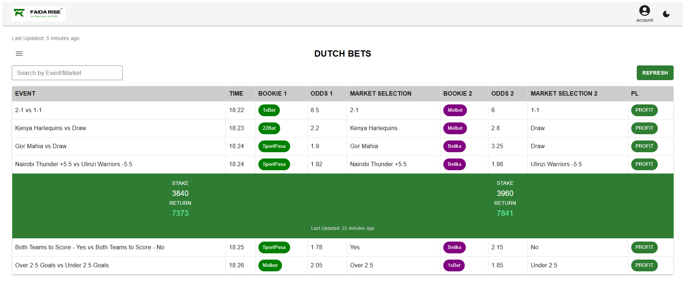

# Dutching Table Application

An Astro + React application showcasing a responsive Dutch betting opportunities table with real-time calculations, expandable rows, and theme toggling using MUI and TanStack Table.

---

## Table of Contents

1. [Project Overview](#project-overview)
2. [Tech Stack](#tech-stack)
3. [Setup & Installation](#setup--installation)
4. [Usage](#usage)
5. \[Folder Structure

```
---

## Features]\(#features)

* [Core Features](#core-features)
* [Enhanced Features](#enhanced-features)

7. [Architecture Decisions](#architecture-decisions)
8. [Testing](#testing)
9. [Future Improvements](#future-improvements)

---

## Project Overview

This project delivers a **Dutching Table** tool for bettors, built as part of the FaidaRise technical assessment. It displays betting opportunities from multiple bookmakers, calculates stakes and returns for a fixed total liability, and updates relative freshness indicators.

Key requirements fulfilled:

* Responsive table layout with collapsible columns on mobile.
* Real-time `Last Updated` timestamps using `dayjs`.
* Expandable rows showing individual stake/return breakdown.
* Dark/light theme toggling persisted in `localStorage`.

---

## Tech Stack

* **Astro**: Static site generator with React integration
* **React**: Component-based UI library
* **TanStack Table v8**: Headless table utility for React
* **MUI v5**: UI component library for styling and layout
* **TypeScript**: Type safety throughout the codebase
* **Day.js** + `relativeTime` plugin: Date formatting and relative timestamps

---

## Setup & Installation

1. **Clone the repository**

   ```bash
   git clone https://github.com/trizahc/astro-appV8.git
   cd astro-appV8/dutching-table
   ```
2. **Install dependencies**

   ```bash
   npm install
   ```
3. **Run development server**

   ```bash
   npm run dev
   ```
4. **Build for production**

   ```bash
   npm run build
   ```
5. **Preview production build**

   ```bash
   npm run preview
   ```

---



## Usage

1. Open [http://localhost:4321](http://localhost:4321) in your browser.
2. Use the **Search** input to filter by event or market names.
3. Click on a row to expand the green breakdown showing individual stake and return calculations (total liability = 2000 KES).
4. Toggle between dark/light mode via the icon in the AppBar. Your preference is saved.
5. Click the **Refresh** button to reload the data from the static `testData.ts` file.

---

## Folder Structure

```
astro-appV8/                # Repository
└── dutching-table/         # Project root
    ├── public/
    │   └── assets/
    │       └── logo.png
    ├── src/
    │   ├── assets/        # Static images and icons
    │   ├── components/    # React components
    │   │   ├── DutchTableTanStack.tsx  # Main table with TanStack integration
    │   │   ├─
    │   │   ├
    │   │   └
    │   ├── data/          # `testData.ts` sample data export
    │   ├── hooks/         # Custom React hooks (e.g., useTheme, useFilteredData)
    │   ├── pages/         # Astro page files
    │   │   └── index.astro
    │   ├── theme/         # MUI theme definitions
    │   │   ├── darkTheme.ts
    │   │   └── lightTheme.ts
    │   └── types/         # TypeScript interfaces
    │       └── DutchBetOpportunity.ts
    ├── package.json
    └── README.md
```

---

## Features

### Core Features

* **TanStack Table** integration for performant table behavior.
* **Expandable Rows**: Click to reveal stake/return combinations in a green background row.
* **Data Freshness**: `Last Updated` relative timestamp generated via `dayjs`.
* **MUI Components**: Consistent styling using AppBar, Table, Chips, Buttons, etc.
* **Theme Toggle**: Dark/Light mode persisted in `localStorage`.

### Enhanced Features

* **Responsive Design**: Mobile-friendly layout with collapsible/hidable columns.
* **Search Filtering**: Filter on both market names and event/team names.
* **Infinite Scroll**: Rows rendered directly without pagination.
* **Real Profit Calculation**: Utility function computes stakes and returns.

---

## Architecture Decisions

* **Component Split**: Single `DutchTableTanStack` encapsulates table logic; future split into `TableHeader`, `TableRow`, `ExpandedRow` for readability.
* **Custom Hooks & State**:

  * `useState` for search filter, expanded row state, and dark/light theme.
  * `useMemo` to derive filtered data list and compute the latest update timestamp efficiently.
  * **TanStack Table**’s `useReactTable` hook powering table core logic (rows, columns, sorting).
* **Table Logic**: Headless TanStack Table for flexibility; data, columns, and core row model from hooks.
* **Styling**: Centralized MUI theme definitions (`theme/light.ts`, `theme/dark.ts`) for consistent brand colors.
* **Data Handling**: Static `testData.ts` for demo; prepared to swap in a data-fetching hook (e.g., React Query) in future.

---

## Testing

Basic test coverage should include:

* **Stake Calculation**: Unit tests for utility functions that compute stakes and returns.
* **Filtering Logic**: Ensure search filters markets and event names correctly.
* **Row Expansion**: Clicking opens and closes the expanded section.
* **Theme Persistence**: Verify `localStorage` toggles dark/light.

Use your preferred test runner (e.g., Jest + React Testing Library) to add tests under `src/__tests__/`.

---

## Future Improvements

* Integrate with a live API using TanStack Query for updated odds.
* Add pagination controls for large datasets.
* Refine accessibility (ARIA roles on expandable rows).
* Implement E2E tests with Cypress for full user flows.
* 

---

*Developed by \[Trizza Chepkirui], FaidaRise Dev Intern Interview Technical Assessment*